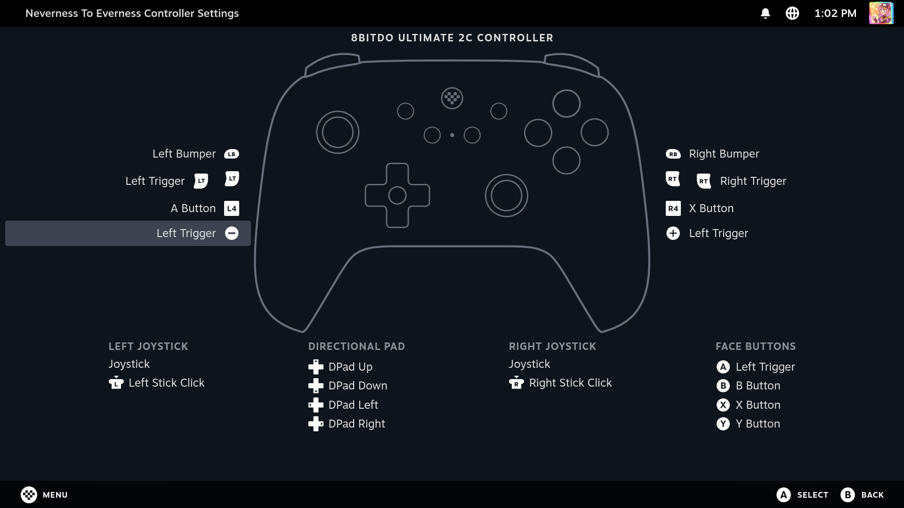

# ZD-O+ Excellence Controller Glyphs

A customized fork of the original 8BitDo Controller Glyphs theme, specifically tailored for the **ZD-O+ Excellence** controller.

## Features Included:
- Replaces generic "Gamepad" text with "ZD-O+ EXCELLENCE"
- Swaps colorful ABXY buttons for sleek, monochrome Steam UI variants.
- Injects native Switch Pro `+` and `-` icons for Start/Select with pixel-perfect bottom-bar scaling.
- Maps L5/R5 to Steam Deck's native L4/R4 visual glyphs.

## Credits
- Original CSS structure and Controller Image by [DeckFilter / victor-borges](https://github.com/victor-borges)
- Custom modifications for the Ultimate 2C by [GGabrielDev](https://github.com/GGabrielDev)

## Quick packaging

- Build ZIP: `./scripts/package_theme.sh`
- Build + deploy to your local CSS Loader themes directory: `./scripts/package_theme.sh --deploy`

The deploy step extracts the built theme into `~/homebrew/themes/zd-oplus-excellence-glyphs` so you can test immediately (restart Steam/CSS Loader after deploying).
